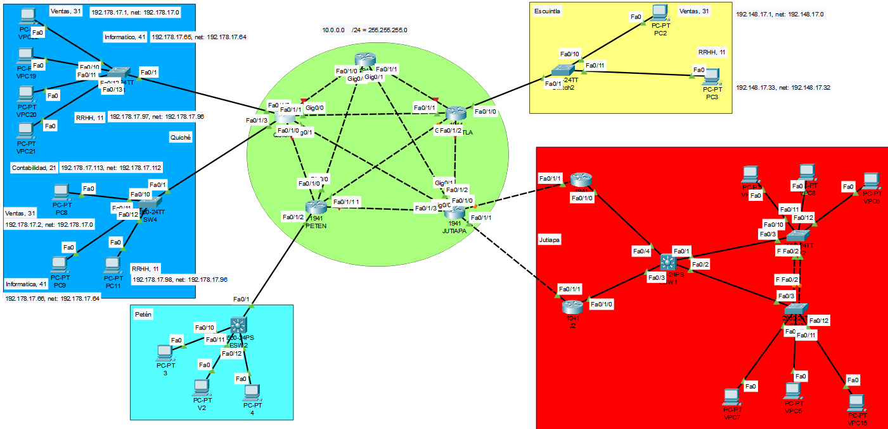
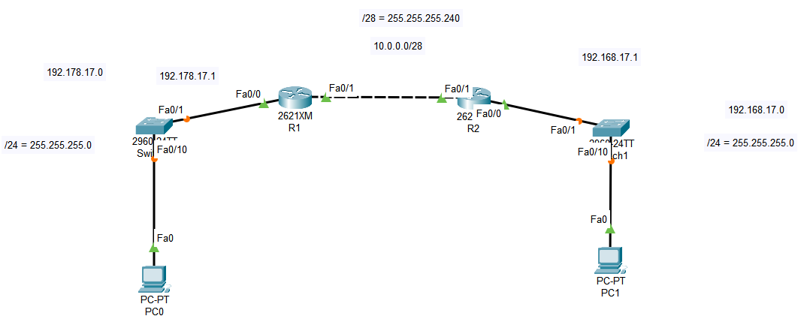

# Universidad de San Carlos de Guatemala
# Facultad de Ingenieria, escuela de Ciencias y Sistemas
# Redes de Computadoras 1
# PROYECTO 2
# GRUPO 9 
*Carnet* | *Nombre* |
| ------ | ------ |
| 201902301 | Piter Angel Esaú Valiente de León |
| 201900647 | Eduardo Josué González Cifuentes |

# TOPOLOGIA


# COMANDOS
```
*/*/ RIP /*/*
=== Central === 
enable
conf t
no ip domain-lookup 
hostname CENTRAL
do wr 

int fa0/1/0
ip add 10.0.0.1 255.255.255.0
no shut
do wr

int gi0/0
ip add 10.0.0.2 255.255.255.0
no shut
do wr

int gi0/1
ip add 10.0.0.3 255.255.255.0
no shut
do wr

int fa0/1/1
int gi0/1
ip add 10.0.0.4 255.255.255.0
no shut
do wr

router rip 
version 2
network 10.0.0.0
do wr


=== Escuintla === 
enable
conf t
no ip domain-lookup 
hostname ESCUINTLA
do wr 

int fa0/1/0
ip add 192.148.17.1 255.255.255.0
no shut
do wr

int gi0/1
ip add 10.0.0.5 255.255.255.0
no shut
do wr

int fa0/1/1
ip add 10.0.0.6 255.255.255.0
no shut
do wr

int gi0/0
ip add 10.0.0.7 255.255.255.0
no shut
do wr

int fa0/1/2
ip add 10.0.0.8 255.255.255.0
no shut
do wr

router rip 
version 2
network 10.0.0.0
network 192.148.17.0 
do wr

=== Jutiapa === 
enable
conf t
no ip domain-lookup 
hostname JUTIAPA
do wr 

int fa0/1/0
ip add 192.168.17.1 255.255.255.0
ip add 192.168.17.2 255.255.255.0
no shut
do wr

int fa0/1/2
ip add 10.0.0.9 255.255.255.0
no shut
do wr

int gi0/1
ip add 10.0.0.10 255.255.255.0
no shut
do wr

int gi0/0
ip add 10.0.0.11 255.255.255.0
no shut
do wr

int fa0/1/3
ip add 10.0.0.12 255.255.255.0
no shut
do wr

router rip 
version 2
network 10.0.0.0
network 192.168.17.0 
do wr


=== Peten === 
enable
conf t
no ip domain-lookup 
hostname PETEN
do wr

int fa0/1/2
ip add 192.158.17.1 255.255.255.0
no shut
do wr

int fa0/1/1
ip add 10.0.0.13 255.255.255.0
no shut
do wr

int gi0/1
ip add 10.0.0.14 255.255.255.0
no shut
do wr

int gi0/0
ip add 10.0.0.15 255.255.255.0
no shut
do wr

int fa0/1/0
ip add 10.0.0.16 255.255.255.0
no shut
do wr

router rip 
version 2
network 10.0.0.0
network 192.158.17.0
do wr

=== Quiché === 
enable
conf t
no ip domain-lookup 
hostname QUICHE
do wr

int fa0/1/2
ip add 192.178.17.1 255.255.255.0
no shut
do wr

int fa0/1/3
ip add 192.178.17.2 255.255.255.0
no shut
do wr

int fa0/1/0
ip add 10.0.0.17 255.255.255.0
no shut
do wr

int gi0/1
ip add 10.0.0.18 255.255.255.0
no shut
do wr

int gi0/0
ip add 10.0.0.19 255.255.255.0
no shut
do wr

int fa0/1/1
ip add 10.0.0.20 255.255.255.0
no shut
do wr
```

# Comandos de parte física


```
=== FISICO, RUTEO RIP ===

=== R1 ===
enable 
conf t
no ip domain-lookup 

int fa0/0
ip add 192.178.17.1 255.255.255.0
no shut 

int fa0/1
ip add 10.0.0.1 255.255.255.240
no shut 

router rip 
version 2
network 192.178.17.0
network 10.0.0.0
do wr

=== R2 ===
enable
conf t
no ip domain-lookup

int fa0/0
ip add 192.168.17.1 255.255.255.0
no shut

int fa0/1
ip add 10.0.0.2 255.255.255.240
no shut 

router rip 
version 2
network 192.168.17.0
network 10.0.0.0
do wr

	=== R1 ===
	enable
	conf t
	do sh ip route   -para verificar 

	do show ip protocol  -otra forma de ver 

=== PC0 ===
IPV4 192.178.17.10
Subnet mask 255.255.255.0
default gateway 192.178.17.1

=== PC1 ===
IPV4 192.168.17.10
Subnet mask 255.255.255.0
default gateway 192.168.17.1

=== hacer ping de pc1 a pc0 ===
ping 192.178.17.1

o

ping 192.178.17.10

```
