# Universidad de San Carlos de Guatemala
# Facultad de Ingenieria, escuela de Ciencias y Sistemas
# Redes de Computadoras 1
## Nombre: Piter Angel Esaú Valiente de León, Carnet: 201902301
## Diseño de Redes 

Conexión de switch a varias pc y de switch en switch, tomando en cuenta que el nivel 1 esta conformado por "Administración, Gerencia, Atención al Cliente y Recursos Humanos" para el nivel 2 se toman las siguientes áreas "Oficina A, Oficina B y Oficina C".

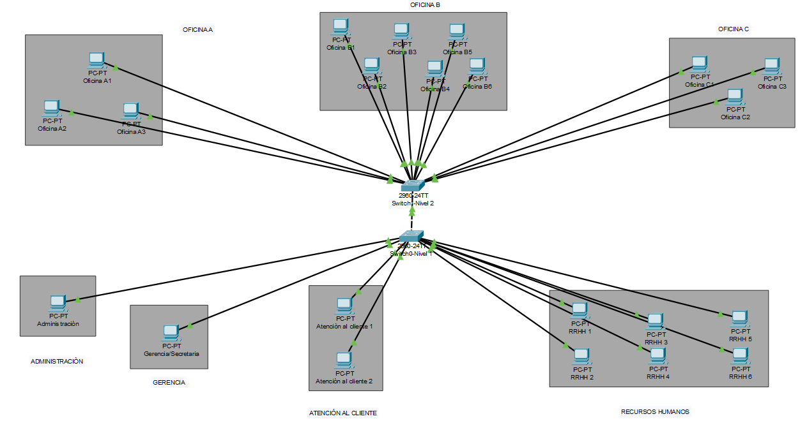

---

## Configuración de Switch (1 y 2)

Tomando en cuenta los comandos utilizados 
```
enable -entrar como ser privilegiado   
 
show run -para todos los puertos que estamos usando

conf t -modo de configuración

exit -para salir

no ip domain-lookup -para al momento de ingresar un mal comando no de mucho problema 

wr -para guardar la configuración

hostname (nombre) -para configurar el cual el nombre que coloquemos

enable secret -para colocar contraseña
```


---

## Configuración VPC 

Área de Administración 
---

---
Área de Gerencia-Secretaria
---

---
Área de Atención al Cliente
---

---
Área de Recursos Humanos
---

---
Área de Oficina A
---

---
Área de Oficina B
---

---
Área de Oficina C
---


---

## Pings entre los hosts
Ping entre Administración a Oficina A
---
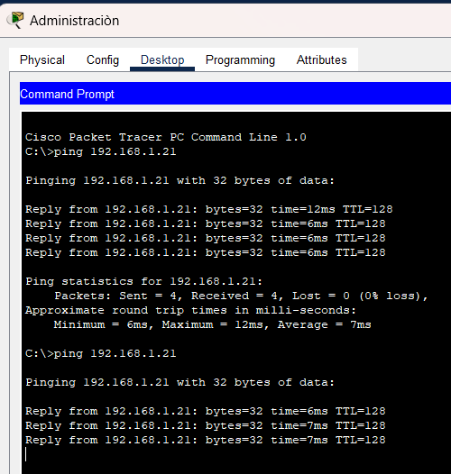
---
Ping entre Oficina B a Gerencia
---
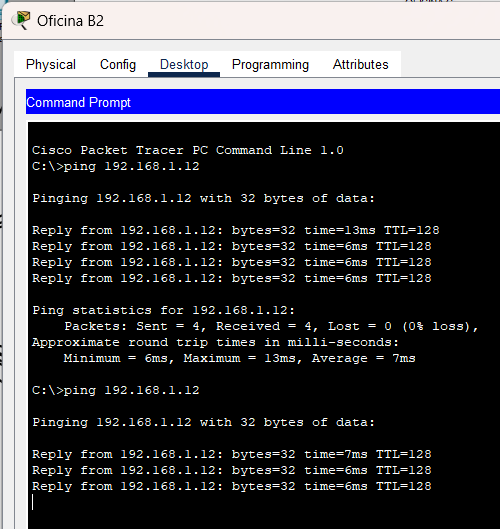
---
Ping entre Atención al Cliente a Oficina C
---
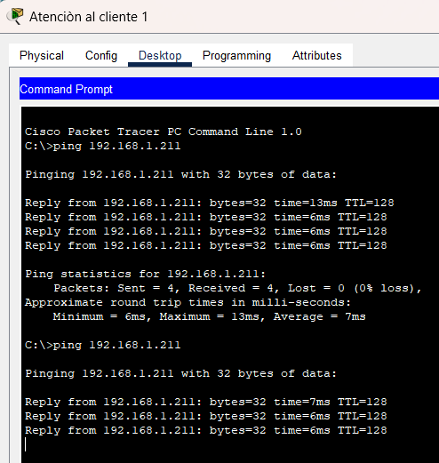

---

## Simulación ARP/ICMP

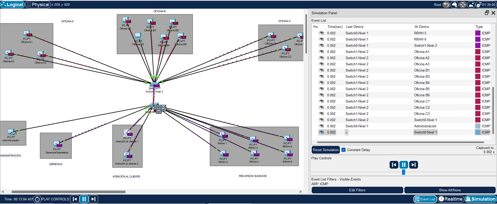
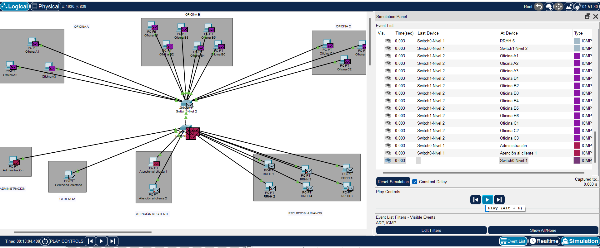
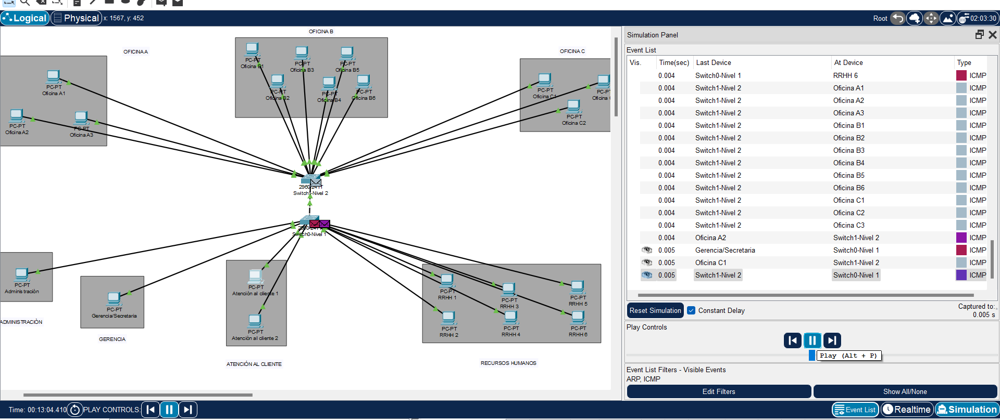
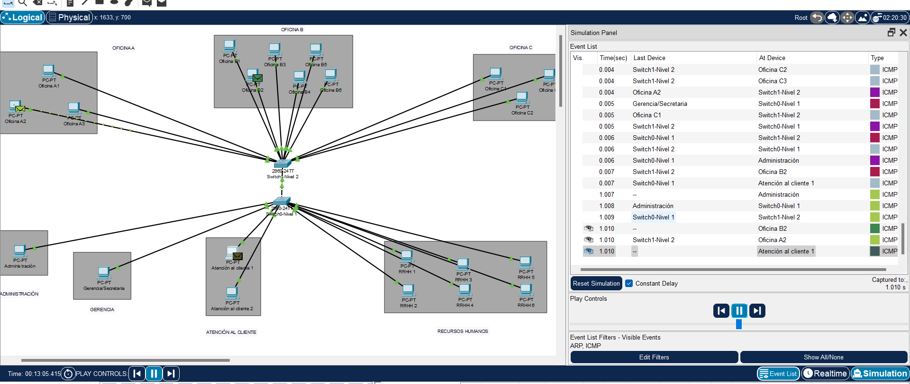
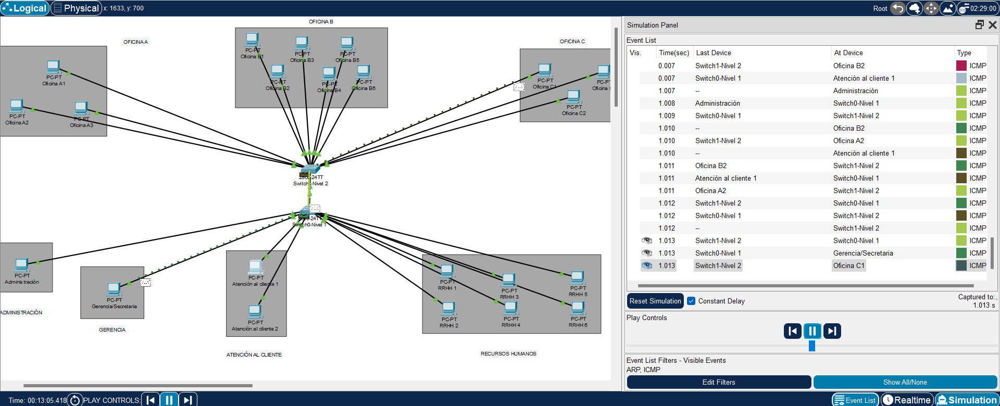
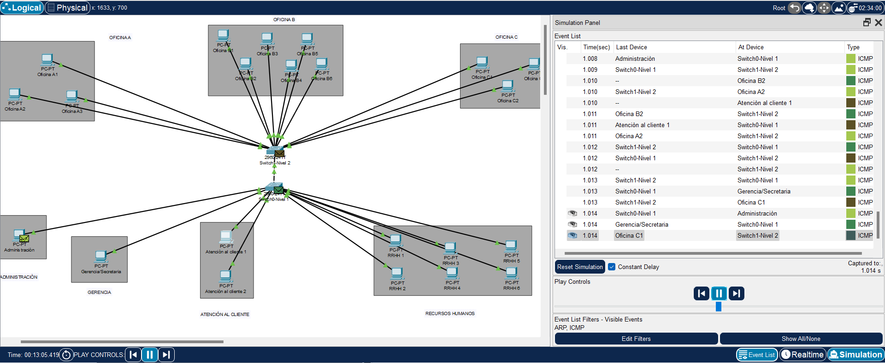

## Demostración de la captura de un paquete ARP/ICMP

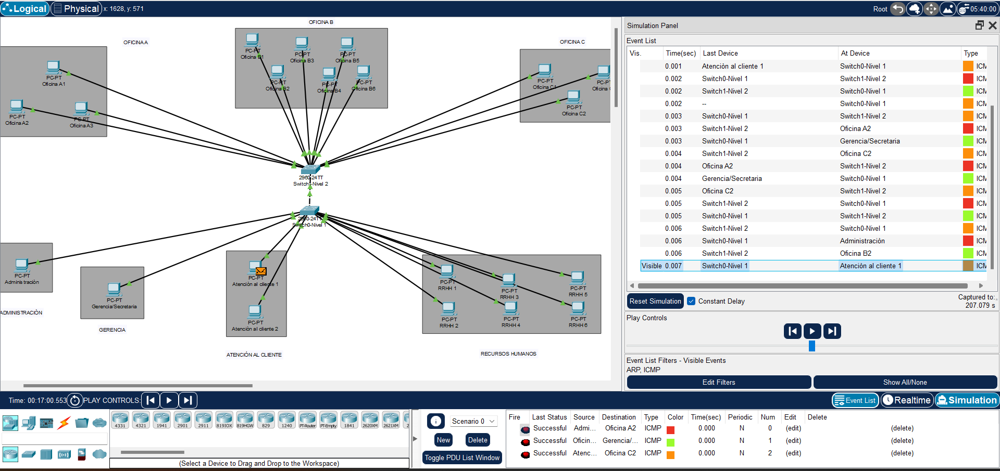