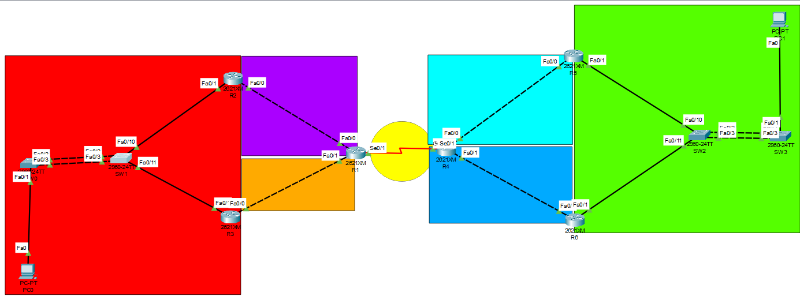

# Universidad de San Carlos de Guatemala
# Facultad de Ingenieria, escuela de Ciencias y Sistemas
# Redes de Computadoras 1
## Nombre: Piter Angel Esaú Valiente de León, Carnet: 201902301

## Topologia


### Objetivos
• Demostrar el conocimiento adquirido respecto a la agregación de enlaces.
• Demostrar el conocimiento adquirido para la creación de rutas estáticas.
• Demostrar el conocimiento adquirido respecto a la puerta de enlace
predeterminada, así como también para el manejo de protocolos de redundancia
en la misma.
• Emplear la herramienta PacketTracer para desarrollar la topología de acuerdo 
con las especificaciones dadas.


##  Configuración de routers R1, R2 y R5, configuración de switch SW1, configuración de VPC11.
### R1
```
=== R1 ===
enable 
conf t
no ip domain-lookup
hostname R1

int s0/1
ip address 10.0.0.1 255.255.255.252
no shutdown
do wr
exit

int f0/0
ip address 112.168.1.2 255.255.255.248
no shutdown
do wr
exit

int f0/1
ip address 112.168.2.2 255.255.255.248
no shutdown
do wr
exit

```

### R2
```
=== R2 ===
enable
conf t
hostname R2
no ip domain-lookup
do wr

int f0/0
ip address 112.168.1.1 255.255.255.248
no shutdown
do wr
exit

int f0/1
ip address 112.168.0.2 255.255.255.0 
no shutdown
do wr
exit


```


### R3
```
=== R3 ===
enable
conf t
hostname R3

int f0/0
ip address 112.168.2.1 255.255.255.248
no shutdown
do wr
exit

int f0/1
ip address 112.168.0.3 255.255.255.0  
no shutdown
do wr
exit

```

### R4
```
=== R4 ===
enable 
conf t
no ip domain-lookup
hostname R4

int s0/1
ip address 10.0.0.2 255.255.255.252
no shutdown
do wr
exit

int f0/0
ip address 112.178.1.1 255.255.255.248
no shutdown
do wr
exit

int f0/1
ip address 112.178.2.1 255.255.255.248
no shutdown
do wr
exit


```


### R5
```
=== R5 ===
enable
conf t
no ip domain-lookup
hostname R5
do wr

int f0/0
ip address 112.178.1.2 255.255.255.248
no shutdown
do wr
exit

int f0/1
ip address 112.178.0.2 255.255.255.0  
no shutdown
do wr
exit

```

### R6
```
=== R6 ===
enable
conf t
no ip domain-lookup
hostname R6
do wr

int f0/0
ip address 112.178.2.2 255.255.255.248
no shutdown
do wr
exit

int f0/1
ip address 112.178.0.3 255.255.255.0 
no shutdown
do wr
exit

```


### SW0
```
=== SW0 ===
enable
conf t
hostname SW0
no ip domain-lookup
do wr 

int range f0/2-3
channel-protocol pagp
channel-group 1 mode desirable
do wr
exit
```


### SW1
```
=== SW1 ===
enable
conf t
hostname SW1
no ip domain-lookup
do wr 

int range f0/2-3
channel-protocol pagp
channel-group 1 mode desirable
do wr
exit
```

### SW2
```
=== SW2 ===
enable
conf t
hostname SW2
no ip domain-lookup
do wr 

int range f0/2-3
channel-protocol lacp
channel-group 1 mode active
do wr
exit
```


### SW3
```
=== SW3 ===
enable
conf t
hostname SW3
no ip domain-lookup
do wr 

int range f0/2-3
channel-protocol lacp
channel-group 1 mode active
do wr
exit
```

### IP ROUTE
```
=== IP ROUTE R2 === 
ip route 112.168.1.0 255.255.255.248 112.168.1.2 
ip route 10.0.0.0 255.255.255.252 112.168.1.2 
ip route 112.178.1.0 255.255.255.248 112.168.1.2 
ip route 112.178.2.0 255.255.255.248 112.168.1.2 
ip route 112.178.0.0 255.255.255.0 112.168.1.2

=== IP ROUTE R3 ===
ip route 112.168.2.0 255.255.255.248 112.168.2.2 
ip route 10.0.0.0 255.255.255.252 112.168.2.2 
ip route 112.178.1.0 255.255.255.248 112.168.2.2 
ip route 112.178.2.0 255.255.255.248 112.168.2.2 
ip route 112.178.0.0 255.255.255.0 112.168.2.2 


=== IP ROUTE R1 ===
ip route 112.178.1.0 255.255.255.248 10.0.0.2 
ip route 112.178.2.0 255.255.255.248 10.0.0.2 
ip route 10.0.0.0 255.255.255.252 10.0.0.2 
ip route 112.178.0.0 255.255.255.0 10.0.0.2 
ip route 112.168.1.0 255.255.255.248 112.168.1.1 
ip route 112.168.0.0 255.255.255.0 112.168.1.1 
ip route 112.168.0.0 255.255.255.0 112.168.2.1 
ip route 112.168.2.0 255.255.255.248 112.168.2.1

=== IP ROUTE R2 ===
ip route 10.0.0.0 255.255.255.252 10.0.0.1 
ip route 112.168.1.0 255.255.255.248 10.0.0.1 
ip route 112.168.2.0 255.255.255.248 10.0.0.1 
ip route 112.168.0.0 255.255.255.0 10.0.0.1 
ip route 112.178.0.0 255.255.255.0 112.178.1.2 
ip route 112.178.1.0 255.255.255.248 112.178.1.2 
ip route 112.178.0.0 255.255.255.0 112.178.2.2 
ip route 112.178.2.0 255.255.255.248 112.178.2.2 


=== IP ROUTE R5 ===
ip route 112.178.1.0 255.255.255.248 112.178.1.1 
ip route 10.0.0.0 255.255.255.252 112.178.1.1 
ip route 112.168.1.0 255.255.255.248 112.178.1.1 
ip route 112.168.2.0 255.255.255.248 112.178.1.1 
ip route 112.168.0.0 255.255.255.0 112.178.1.1


=== IP ROUTE R6 ===
ip route 112.178.2.0 255.255.255.248 112.178.2.1 
ip route 10.0.0.0 255.255.255.252 112.178.2.1 
ip route 112.168.1.0 255.255.255.248 112.178.2.1 
ip route 112.168.2.0 255.255.255.248 112.178.2.1 
ip route 112.168.0.0 255.255.255.0 112.178.2.1
```

### Creación de ruta estática
```
ip add 112.168.1.1 255.255.255.0
```

### creación de PortChannel con PAGP y LACP
#### PAGP
```
int range f0/1-2
channel-protocol pagp
channel-group 1 mode desiderable
```
#### LACP
```
int range f0/1-2
channel-protocol lacp
channel-group 1 mode active
```

### Creación de IP virtual con HSRP y GLBP
#### HSRP
```
standby 10 ip 112.168.1.254
standby 10 priority 150
standby 10 preempt
no shut
```
#### GLBP
```
glbp 1 ip 112.168.1.254
glbp 1 preempt
glbp 1 priority 150
glbp 1 load-balancing round-robin
no shut
```
### configuración de VPC
```
112.168.0.4 <VPC11>
112.178.0.4 <VPC12>
```


### Comandos empleados para la verificación del correcto funcionamiento de los protocolos empleados para la realización de la práctica.
```
do sh run
show etherchannel summary
```