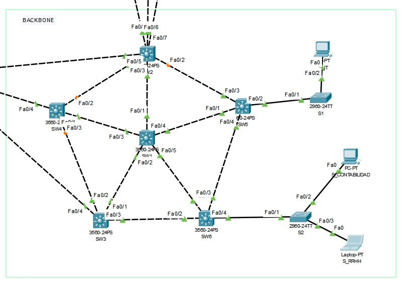
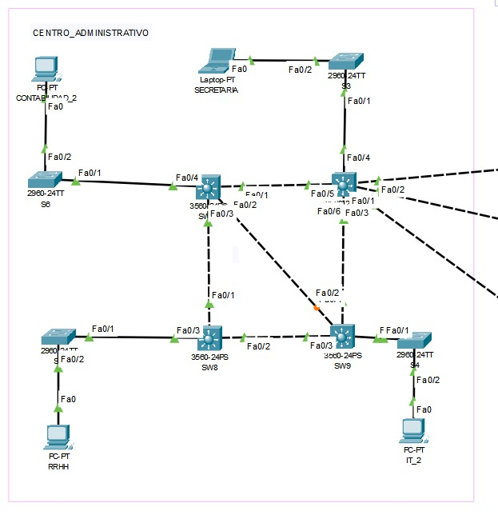
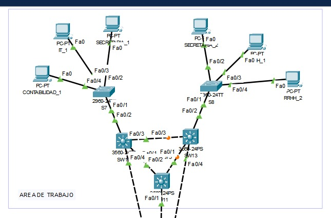
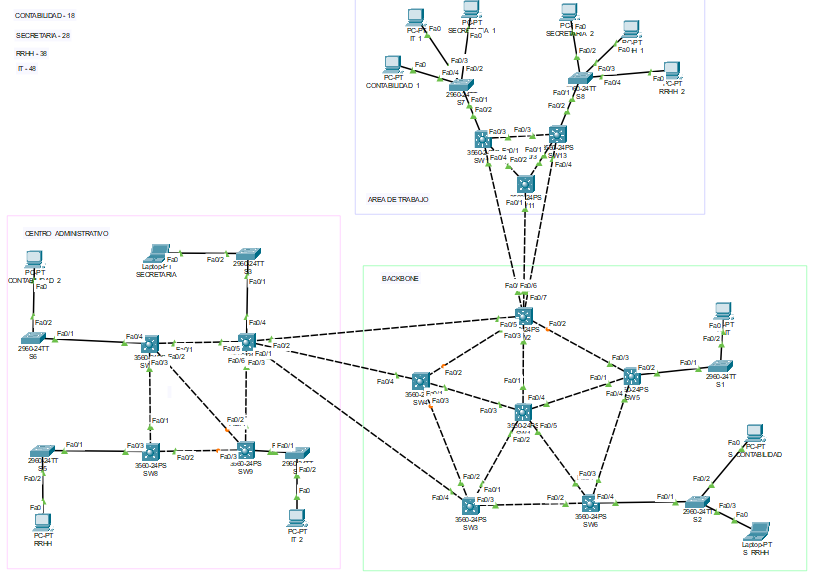
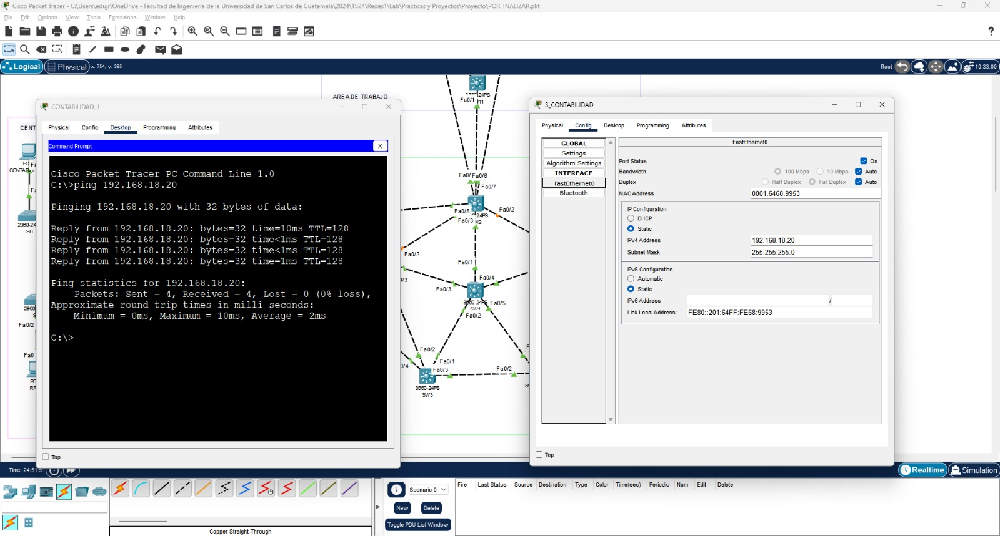
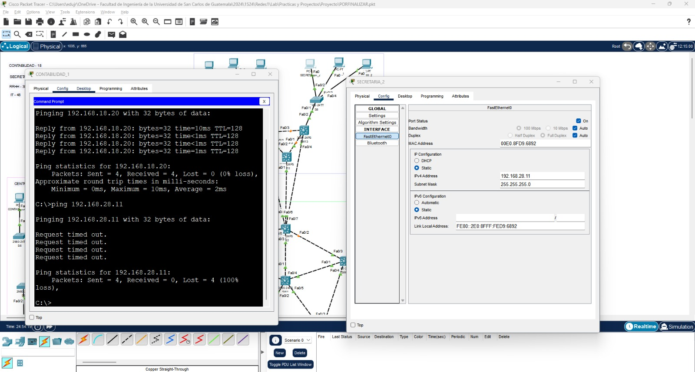
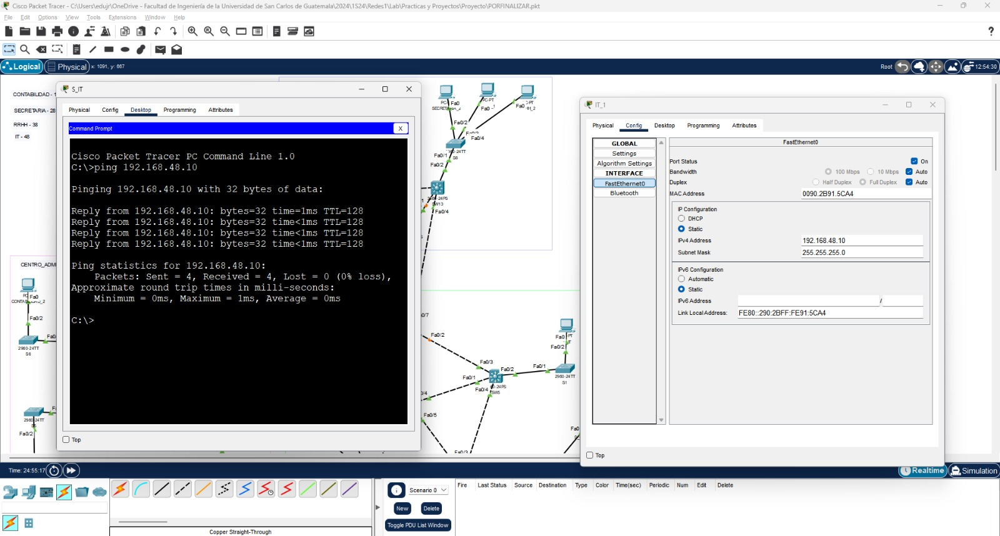
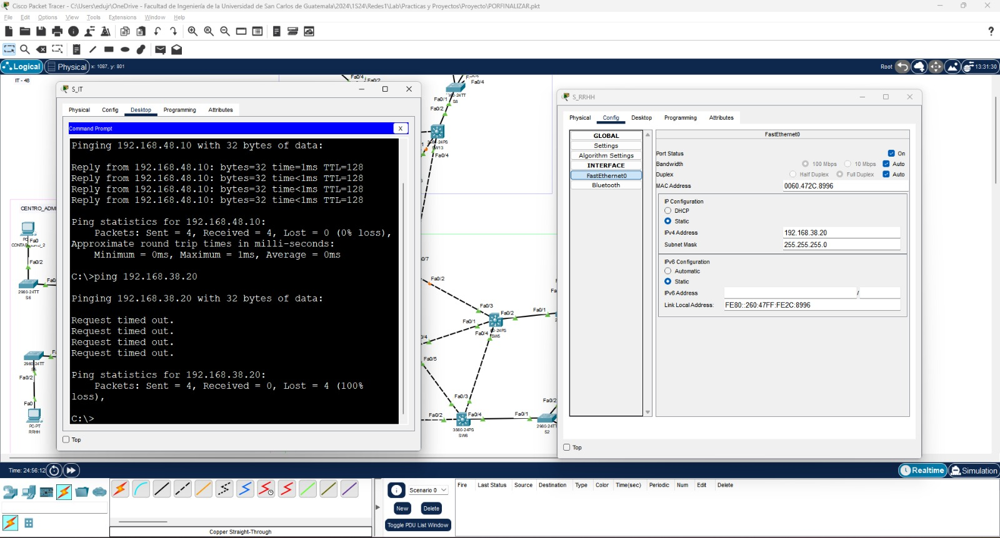

# Universidad de San Carlos de Guatemala
# Facultad de Ingenieria, escuela de Ciencias y Sistemas
# Redes de Computadoras 1
# PROYECTO 1
# GRUPO 9 
*Carnet* | *Nombre* |
| ------ | ------ |
| 201902301 | Piter Angel Esaú Valiente de León |
| 201900647 | Eduardo Josué González Cifuentes |

# TOPOLOGIAS
## BACKBONE

## CENTRO ADMINISTRATIVO

## AREA DE TRABAJO

## TOPOLOGIA

# CONFIGURACIÓN DE IPS
*Departamento* | *VLAN* |*ID de red* |
| ------ | ------ |------ |
| Contabilidad_1 | 18 |192.168.18.10 |
| Contabilidad_2 | 18 |192.168.18.11 |
| S_Contabilidad | 18 |192.168.18.20 |
| Secretaria_1   | 28 |192.168.28.10 |
| Secretaria_2   | 28 |192.168.28.11 |
| Secretaria     | 28 |192.168.28.12 |
| RRHH_1         | 38 |192.168.38.10 |
| RRHH_2         | 38 |192.168.38.11 |
| S_RRHH         | 38 |192.168.38.20 |
| IT_1           | 48 |192.168.48.10 |
| IT_2           | 48 |192.168.48.11 |
| S_IT           | 48 |192.168.48.20 |

# CONFIGURACION DE DOMINIO
*Dominio* | *Contraseña* |
| ------ | ------ |
| P9 | usac |

# PRIMERA CONFIGURACIÓN DE SWITCHES
## SERVER SW1
``` 
enable
conf t
no ip domain-lookup
hostname SW1
do w

interface range fa0/1-5   Para el rango de interfaz de 1 a 5
switchport trunk encapsulation dot1q
switchport mode trunk     CAMBIO DE LAS INTERFASES

vlan 18
name CONTABILIDAD
vlan 28
name SECRETARIA
vlan 38
name RRHH
vlan 48
name IT
end
```
## CLIENTES:  SW7, SW8, SW10, SW2, SW3, SW4, SW5, SW6, SW11, SW12, SW13

## SW2
```
enable
conf t
no ip domain-lookup
hostname SW2
do wr
int f0/1
switchport trunk encapsulation dot1q
switchport mode trunk
do w
```
Tomando en cuenta la configuración anterior se determina de la misma manera a los otros clientes unicamente cambiando y verificando el hostname e int f0/1

# SEGUNDA CONFIGURACIÓN DE SWITCHES
## CLIENTES: SW2, SW3, SW4, SW5, SW6, SW7, SW8, SW10, SW11, SW12, SW13

## SW2
``` 
enable 
conf t
int range f0/1-3
switchport trunk encapsulation dot1q
switchport mode trunk
switchport trunk allowed vlan 1,18,28,38,48,1002-1005
do wr 
do sh vlan
```
Del switch anterior se configua tomando en cuenta el rango de interfaces f0/"de donde hacia donde" para una correcta funcionalidad y conexión, se realiza lo mismo para los demás switch clientes cambiando de igual forma el rango de interface.

# TERCERA CONFIGURACIÓN DE SWITCHES
## CLIENTES:  S1, S2, S3, S4, S5, S7, S8
## S6
```
enable
conf t
hostname S6
vtp mode client
vtp domain P9
vtp password usac
int range f0/1
switchport trunk encapsulation dot1q
switchport mode trunk
switchport trunk allowed vlan 1,18,28,38,48,1002-1005
do wr 
do sh vlan
```
Luego colocamos la interfaz o interfaces dependiendo de las conexiones, ingresamos a la interfaz para colocar acceso a la vlan que se quiera conectar y hacer ping.
```
int f0/2
switchport mode access 
switchport access vlan 18
do wr
exit
```
# CUARTA CONFIGURACIÓN DE SWITCHES
## CLIENTES: SW1, SW2, SW3, SW4, SW5, SW6, SW7, SW8, SW10, SW11, SW12, SW13, S1, S2, S3, S4, S5, S7, S8
## SW1
```
spanning-tree mode rapid-pvst
do wr
```
Colocamos en todos los switches de capa 2 y capa 3 tomando en cuenta que se utiliza en dispositivos de red para configurar el protocolo de árbol de expansión (Spanning Tree Protocol, STP) en modo de selección rápida con Protocolo de Árbol de Expansión Per-VLAN Rápido (Rapid PVST). Este comando se utiliza comúnmente en dispositivos de red Cisco para optimizar la convergencia del árbol de expansión y reducir el tiempo de inactividad en caso de cambios en la topología de la red.

# PINGS ENTRE HOSTS
## Ping CONTABILIDAD_1 A S_CONTABILIDAD

## Ping de CONTABILIDAD_1 a SECRETARIA_2

No hace ping porque no es su vlan
## PING de S_IT a IT_1

## PING DE S_IT a S_RRHH

No hace ping porque no es su vlan
